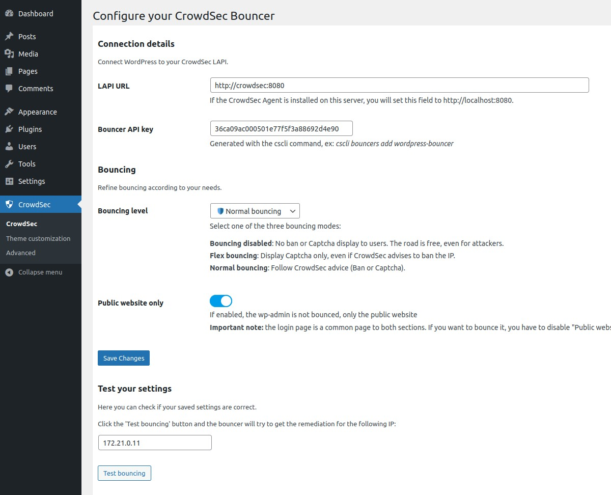

# CrowdSec WordPress Bouncer

## User Guide

<!-- START doctoc generated TOC please keep comment here to allow auto update -->
<!-- DON'T EDIT THIS SECTION, INSTEAD RE-RUN doctoc TO UPDATE -->
**Table of Contents**

- [Description](#description)
- [Prerequisites](#prerequisites)
- [Usage](#usage)
  - [Features](#features)
  - [Configurations](#configurations)
    - [General settings](#general-settings)
    - [Theme customization](#theme-customization)
    - [Advanced settings](#advanced-settings)
  - [Auto Prepend File mode](#auto-prepend-file-mode)
    - [PHP](#php)
    - [Nginx](#nginx)
    - [Apache](#apache)
- [Resources](#resources)

<!-- END doctoc generated TOC please keep comment here to allow auto update -->


## Description

The `CrowdSec Bouncer` plugin for WordPress has been designed to protect WordPress websites from all kinds of 
attacks by using [CrowdSec](https://www.crowdsec.net/) technology.

## Prerequisites

To be able to use this bouncer, the first step is to install [CrowdSec v1](https://doc.crowdsec.net/docs/getting_started/install_crowdsec/).
CrowdSec is only in charge of the "detection", and won't block anything on its own. You need to deploy a bouncer to "apply" decisions.

Please note that first and foremost CrowdSec must be installed on a server that is accessible via the WordPress site.


## Usage

### Features

When a user is suspected by CrowdSec to be malevolent, this bouncer will either send him/her a captcha to resolve or
simply a page notifying that access is denied. If the user is considered as a clean user, he will access the page as normal.

By default, the ban wall is displayed as below:


By default, the captcha wall is displayed as below:


Please note that it is possible to customize all the colors of these pages in a few clicks so that they integrate best with your design.

On the other hand, all texts are also fully customizable. This will allow you, for example, to present translated pages in your users’ language.


### Configurations

This plugin comes with configurations that you will find under `CrowdSec` admin section.

These configurations are divided in three main parts : `CrowdSec`, `Theme customization`,and `Advanced`.

#### General settings

In the `CrowdSec` part, you will set your connection details and refine bouncing according to your needs. You will 
also be able to test your settings.



***


`Connection details → LAPI URL`

Url to join your CrowdSec LAPI.

***

`Connection details → Bouncer API key`

Key generated by the cscli command.


***

`Connection details → Use cURL to call LAPI`

By default, `file_get_contents` method is used to call LAPI. This method requires to have enabled the option 
`allow_url_fopen`. 
Here, you can choose to use `cURL` requests instead. Beware that in this case, you need to have php `cURL` extension 
installed and enabled on your system.

***

`Bouncing → Bouncing level`

Choose if you want to apply CrowdSec directives (`Normal bouncing`) or be more permissive (`Flex bouncing`).

With the `Flex mode`, it is impossible to accidentally block access to your site to people who don’t deserve it. This
mode makes it possible to never ban an IP but only to offer a Captcha, in the worst-case scenario.

***

`Bouncing → Public website only`

If enabled, the admin is not bounced.

***


`Test your settings → Test bouncing`

Click the "Test bouncing" button and the configured bouncer will try to get the remediation (bypass, captcha or ban) 
for 
the IP entered in the text field. By default, tested IP is the current detected remote IP.

This test allows you to know if your connection, bouncing and cache settings are correct.


***

`Test your settings → Test geolocation`

Click the "Test geolocation" button to try getting country for the IP entered in the text field.

This test allows you to know if your geolocation settings are correct.


#### Theme customization

In the `Theme customization` part, you can modify texts and colors of ban and captcha walls.


#### Advanced settings

In the `Advanced` part, you can enable/disable the stream mode, choose your cache system for your CrowdSec
LAPI, handle your remediation policy, manage geolocation feature, adjust some debug parameters and testing parameters. 


***

`Communication mode to the API → Enable the "Stream mode"`

Choose if you want to enable the `stream mode` or stay in `live mode`.


By default, the `live mode` is enabled. The first time a stranger connects to your website, this mode means that the IP will be checked directly by the CrowdSec API. The rest of your user’s browsing will be even more transparent thanks to the fully customizable cache system.

But you can also activate the `stream mode`. This mode allows you to constantly feed the bouncer with the malicious IP list via a background task (CRON), making it to be even faster when checking the IP of your visitors. Besides, if your site has a lot of unique visitors at the same time, this will not influence the traffic to the API of your CrowdSec instance.

***

`Communication mode to the API → Resync decisions each (stream mode only)`

With the stream mode, every decision is retrieved in an asynchronous way. Here you can define the frequency of this
cache refresh.

**N.B** : There is also a refresh button if you want to refresh the cache manually.

***


***

`Caching configuration → Technology`

Choose the cache technology that will use your CrowdSec LAPI.

The File system cache is faster than calling LAPI. Redis or Memcached is faster than the File System cache.

**N.B** : There are also a `Clear now` button fo all cache technologies and a `Prune now` button dedicated to the
file system cache.

***

`Caching configuration → Recheck clean IPs each (live mode only)`

The duration between re-asking LAPI about an already checked clean IP.

Minimum 1 second.  Note that this setting can not be apply in stream mode.

***

`Caching configuration → Recheck bad IPs each (live mode only)`

The duration between re-asking LAPI about an already checked bad IP.

Minimum 1 second.  Note that this setting can not be apply in stream mode.


***

`Caching configuration → Captcha flow cache lifetime`

The lifetime of cached captcha flow for some IP.

If a user has to interact with a captcha wall,
we store in cache some values in order to know if he has to resolve or not the captcha again.

Minimum 1 second. Default: 86400 seconds.

***

`Caching configuration → Geolocation cache lifetime`

The lifetime of cached country geolocation result for some IP.

Minimum 1 second. Default: 86400 seconds.


***


***

`Remediations → Fallback to`

Choose which remediation to apply when CrowdSec advises unhandled remediation.

***

`Remediations → Trust these CDN IPs (or Load Balancer, HTTP Proxy)`

If you use a CDN, a reverse proxy or a load balancer, it is possible to indicate in the bouncer settings the IP ranges of these devices in order to be able to check the IP of your users. For other IPs, the bouncer will not trust the X-Forwarded-For header.
***

`Remediations → Hide CrowdSec mentions`

Enable if you want to hide CrowdSec mentions on the Ban and Captcha walls.


***


***

`Geolocation → Enable geolocation feature`

Enable if you want to use also CrowdSec country scoped decisions.
If enabled, bounced IP will be geolocalized and the final remediation will take into account any country related decision.

***

`Geolocation → Geolocation type`


For now, only `Maxmind database` type is allowed

***

`Geolocation → MaxMind database type`

Choose between `Country` and `City`.


***

`Geolocation → Path to the MaxMind database`

Relative path from `wp-content/plugins/crowdsec/geolocation` folder.

***

`Geolocation → Save geolocalized country in cache`

Enabling this will avoid multiple call to the geolocation system (e.g. MaxMind database)
If enabled, the geolocalized country associated to the IP will be saved in cache.
See the `Geolocation cache lifetime` setting above to set the lifetime of this result.

***


***

`Debug mode → Enable debug mode`

Enable if you want to see some debug information in a specific log file.

When this mode is enabled, a `debug.log` file will be written in `wp-content/plugins/crowdsec/logs` folder.

***

`Debug mode → Disable prod log`

By default, a `prod.log` file will be written in `wp-content/plugins/crowdsec/logs` folder.

You can disable this log here.


***

`Display errors → Enable errors display`

When this mode is enabled, you will see every unexpected bouncing errors in the browser.
Should be disabled in production.


***


***


`Test settings → Forced test IP`

This Ip will be used instead of the current detected browser IP.
**Must be empty in production.**

***

`Test settings → Forced test X-Forwarded-For IP`

This Ip will be used instead of the current X-Forwarded-For Ip if any.
**Must be empty in production.**


### Auto Prepend File mode

By default, this extension will bounce every web requests that pass through the classical process of WordPress core loading.
This implies that if another php public script is called (any of your custom public php script for example)
or if you are using some plugin that bypass the WordPress core load process
(as the [WP Super Cache plugin](https://wordpress.org/plugins/wp-super-cache/) in Simple mode for example), bouncing will not be effective.

To ensure that any php script will be bounced if called from a browser, you should try the `auto prepend file` mode.

In this mode, every browser access to a php script will be bounced.

To enable the `auto prepend file` mode, you have to configure your server by adding an `auto_prepend_file` directive 
for your php setup.

**N.B:**
- In this mode, a setting file `inc/standalone-settings.php` will be generated each time you save the 
  CrowdSec plugin configuration from the WordPress admin.


Adding an `auto_prepend_file` directive can be done in different ways:

#### PHP

You should add this line to a `.ini` file :

    auto_prepend_file = /wordpress-root-directory/wp-content/plugins/crowdsec/inc/standalone-bounce.php


#### Nginx


If you are using Nginx, you should modify your Magento 2 nginx configuration file by adding a `fastcgi_param`
directive. The php block should look like below:

```
location ~ \.php$ {
    ...
    ...
    ...
    fastcgi_param PHP_VALUE "/wordpress-root-directory/wp-content/plugins/crowdsec/inc/standalone-bounce.php";
}
```

#### Apache

If you are using Apache, you should add this line to your `.htaccess` file:

    php_value auto_prepend_file "/wordpress-root-directory/wp-content/plugins/crowdsec/inc/standalone-bounce.php"


## Resources

Feel free to look at the [associated article](https://www.crowdsec.net/blog/wordpress-bouncer) for more configuration options and tweaks.
