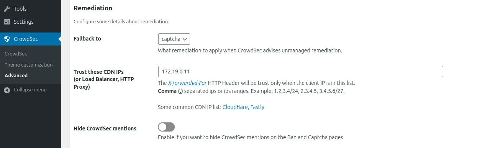
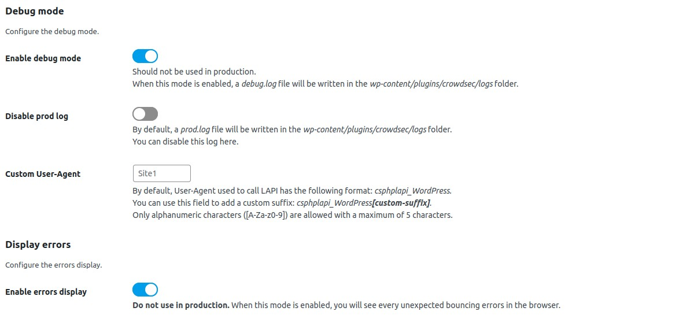

# CrowdSec WordPress Bouncer

## User Guide

<!-- START doctoc generated TOC please keep comment here to allow auto update -->
<!-- DON'T EDIT THIS SECTION, INSTEAD RE-RUN doctoc TO UPDATE -->
**Table of Contents**

- [Description](#description)
- [Prerequisites](#prerequisites)
- [Usage](#usage)
  - [Features](#features)
  - [Configurations](#configurations)
    - [General settings](#general-settings)
    - [Theme customization](#theme-customization)
    - [Advanced settings](#advanced-settings)
    - [Settings update with WP-CLI tool](#settings-update-with-wp-cli-tool)
  - [Security](#security)
    - [Nginx](#nginx)
    - [Apache](#apache)
  - [Auto Prepend File mode](#auto-prepend-file-mode)
    - [PHP](#php)
    - [Nginx](#nginx-1)
    - [Apache](#apache-1)
- [Resources](#resources)

<!-- END doctoc generated TOC please keep comment here to allow auto update -->


## Description

The `CrowdSec Bouncer` plugin for WordPress has been designed to protect WordPress websites from all kinds of 
attacks by using [CrowdSec](https://www.crowdsec.net/) technology.

## Prerequisites

To be able to use this bouncer, the first step is to install [CrowdSec v1](https://doc.crowdsec.net/docs/getting_started/install_crowdsec/).

CrowdSec is only in charge of the "detection", and won't block anything on its own. You need to deploy a bouncer to "apply" decisions.

Please note that first and foremost CrowdSec must be installed on a server that is accessible via the WordPress site.


## Usage

### Features

When a user is suspected by CrowdSec to be malevolent, this bouncer will either send him/her a captcha to resolve or
simply a page notifying that access is denied. If the user is considered as a clean user, he will access the page as normal.

By default, the ban wall is displayed as below:


By default, the captcha wall is displayed as below:


Please note that it is possible to customize all the colors of these pages in a few clicks so that they integrate best with your design.

On the other hand, all texts are also fully customizable. This will allow you, for example, to present translated pages in your users’ language.


### Configurations

This plugin comes with configurations that you will find under `CrowdSec` admin section.

These configurations are divided in three main parts : `CrowdSec`, `Theme customization` and `Advanced`.

#### General settings

In the `CrowdSec` part, you will set your connection details and refine bouncing according to your needs. You will 
also be able to test your settings.


***

`Connection details → Local API URL`

Url to join your CrowdSec Local API.

If the CrowdSec Agent is installed on this server, you could set this field to `http://localhost:8080`.

***

`Connection details → Authentication type`

Choose between `Bouncer API key` and `TLS certificates` (pki) authentication.

TLS authentication is only available if you use CrowdSec agent with a version superior to 1.4.0.
Please see [CrowdSec documentation](https://docs.crowdsec.net/docs/local_api/tls_auth/).

***

`Connection details → Bouncer API key`

Key generated by the cscli command.

Only if you chose `Bouncer API key` as authentication type.

***

`Connection details → Path to the bouncer certificate` 

Relative path to the `wp-content/plugins/crowdsec/tls` folder of your WordPress instance.

Example: `bouncer.pem`.

Only if you chose `TLS certificates` as authentication type.

***

`Connection details → Path to the bouncer key`

Relative path to the `wp-content/plugins/crowdsec/tls` folder of your WordPress instance.

Example: `bouncer-key.pem`.

Only if you chose `TLS certificates` as authentication type.

***

`Connection details → Verify peer`

This option determines whether request handler verifies the authenticity of the peer's certificate.

Only if you chose `TLS certificates` as authentication type.

When negotiating a TLS or SSL connection, the server sends a certificate indicating its identity. If `Verify peer` is checked, request handler verifies whether the certificate is authentic. This trust is based on a chain of digital signatures, rooted in certification authority (CA) certificate you supply using the `Path to the CA used to process for peer verification` setting below.

***

`Connection details → Path to the CA certificate used to process peer verification`

Relative path to the `wp-content/plugins/crowdsec/tls` folder of your WordPress instance.

Example: `ca-chain.pem`.

Only if you chose `TLS certificates` as authentication type.


***

`Connection details → Use cURL to call Local API`

By default, `file_get_contents` method is used to call Local API. This method requires to have enabled the option `allow_url_fopen`. 
Here, you can choose to use `cURL` requests instead. Beware that in this case, you need to have php `cURL` extension installed and enabled on your system.


***

`Connection details → Local API request timeout`

By default, the maximum allowed time to perform a Local API request is 120 seconds. You can change this setting here. If you set a negative value, request timeout will be unlimited. 


***


`Bouncing → Bouncing level`

Choose if you want to apply CrowdSec directives (`Normal bouncing`) or be more permissive (`Flex bouncing`).

With the `Flex mode`, it is impossible to accidentally block access to your site to people who don’t deserve it. This mode makes it possible to never ban an IP but only to offer a captcha, in the worst-case scenario.

***

`Bouncing → Public website only`

If enabled, the admin view is not bounced.

***


`Test your settings → Test bouncing`

Click the "Test bouncing" button and the configured bouncer will try to get the remediation (bypass, captcha or ban) for the IP entered in the text field. By default, tested IP is the current detected remote IP.

This test allows you to know if your connection, bouncing and cache settings are correct.


***

`Test your settings → Test geolocation`

Click the "Test geolocation" button to try getting country for the IP entered in the text field.

This test allows you to know if your geolocation settings are correct.

#### Theme customization

In the `Theme customization` part, you can modify texts and colors of ban and captcha walls.


#### Advanced settings

In the `Advanced` part, you can enable/disable the stream mode, choose your cache system for your CrowdSec Local API, handle your remediation policy, manage geolocation feature, adjust some debug parameters and testing parameters. 


***

`Communication mode to the API → Enable the "Stream mode"`

Choose if you want to enable the `stream mode` or stay in `live mode`.


By default, the `live mode` is enabled. The first time a stranger connects to your website, this mode means that the IP will be checked directly by the CrowdSec API. The rest of your user’s browsing will be even more transparent thanks to the fully customizable cache system.

But you can also activate the `stream mode`. This mode allows you to constantly feed the bouncer with the malicious IP list via a background task (CRON), making it to be even faster when checking the IP of your visitors. Besides, if your site has a lot of unique visitors at the same time, this will not influence the traffic to the API of your CrowdSec instance.

***

`Communication mode to the API → Resync decisions each (stream mode only)`

With the stream mode, every decision is retrieved in an asynchronous way. Here you can define the frequency of this cache refresh.

**N.B** : There is also a refresh button if you want to refresh the cache manually.

***


***

`Caching configuration → Technology`

Choose the cache technology that will use your CrowdSec Local API.

The File system cache is faster than calling Local API. Redis or Memcached is faster than the File System cache.

**N.B**. : There are also a `Clear now` button fo all cache technologies and a `Prune now` button dedicated to the file system cache.

***

`Caching configuration → Recheck clean IPs each (live mode only)`

The duration between re-asking Local API about an already checked clean IP.

Minimum 1 second.  Note that this setting can not be apply in stream mode.

***

`Caching configuration → Recheck bad IPs each (live mode only)`

The duration between re-asking Local API about an already checked bad IP.

Minimum 1 second.  Note that this setting can not be apply in stream mode.


***

`Caching configuration → Captcha flow cache lifetime`

The lifetime of cached captcha flow for some IP.

If a user has to interact with a captcha wall,
we store in cache some values in order to know if he has to resolve or not the captcha again.

Minimum 1 second. Default: 86400 seconds.

------

`Caching configuration → Redis DSN (if applicable)`

Fill in this field only if you have chosen the Redis cache.

Example of DSN: redis://localhost:6379.

------

`Caching configuration → Memcached DSN (if applicable)`

Fill in this field only if you have chosen the Memcached cache.

Example of DSN: memcached://localhost:11211.

***



***

`Remediations → Fallback to`

Choose which remediation to apply when CrowdSec advises unhandled remediation.

***

`Remediations → Trust these CDN IPs (or Load Balancer, HTTP Proxy)`

If you use a CDN, a reverse proxy or a load balancer, it is possible to indicate in the bouncer settings the IP ranges of these devices in order to be able to check the IP of your users. For other IPs, the bouncer will not trust the X-Forwarded-For header.
***

`Remediations → Hide CrowdSec mentions`

Enable if you want to hide CrowdSec mentions on the Ban and Captcha walls.


***


***

`Geolocation → Enable geolocation feature`

Enable if you want to use also CrowdSec country scoped decisions.
If enabled, bounced IP will be geolocalized and the final remediation will take into account any country related decision.

***

`Geolocation → Geolocation type`


For now, only `Maxmind database` type is allowed

***

`Geolocation → MaxMind database type`

Choose between `Country` and `City`.


***

`Geolocation → Path to the MaxMind database`

Relative path from `wp-content/plugins/crowdsec/geolocation` folder.

***

`Geolocation → Geolocation cache lifetime`

The lifetime of cached country geolocation result for some IP. Default: 86400.
Set 0 to disable caching. Enabling this will avoid multiple call to the geolocation system (e.g. MaxMind database)

***




***

`Debug mode → Enable debug mode`

Enable if you want to see some debug information in a specific log file.

When this mode is enabled, a `debug.log` file will be written in `wp-content/plugins/crowdsec/logs` folder.

***

`Debug mode → Disable prod log`

By default, a `prod.log` file will be written in `wp-content/plugins/crowdsec/logs` folder.

You can disable this log here.


`Debug mode → Custom User-Agent`

By default, User-Agent used to call LAPI has the following format: `csphplapi_WordPress`.

You can use this field to add a custom suffix: `csphplapi_WordPress[custom-suffix]`.

This can be useful to debug crowdsec logs when using multiple WordPress sites with multiple bouncer plugins.

Only alphanumeric characters (`[A-Za-z0-9]`) are allowed with a maximum of 5 characters.


***


***

`Display errors → Enable errors display`

When this mode is enabled, you will see every unexpected bouncing errors in the browser.
Should be disabled in production.


***


***


`Test settings → Forced test IP`

This Ip will be used instead of the current detected browser IP.

**Must be empty in production.**

***

`Test settings → Forced test X-Forwarded-For IP`

This Ip will be used instead of the current X-Forwarded-For Ip if any.

**Must be empty in production.**


#### Settings update with WP-CLI tool

Here are some examples of how to set options with the `WP-CLI` tool.

 **:warning:** : Some actions are triggered by a manual modification of the settings in the admin interface. Setting flagged with **:warning:** triggers some action. For example, changing the cache system triggers a cache flush of the old cache system. Modifying those values with `WP-CLI` will not trigger these actions. 


| Settings                                                     | Examples                                                     |
| :----------------------------------------------------------- | ------------------------------------------------------------ |
| **General settings** → *Connection details*                  |                                                              |
| `Local API URL`                                              | `wp option set crowdsec_api_url https://crowdsec:8080`       |
| `Authentication type`                                        | - `wp option set crowdsec_auth_type api_key`<br />- `wp option set crowdsec_auth_type tls` |
| `Bouncer API key`                                            | `wp option set crowdsec_api_key ab483bd8fa665d66c494c0c36e2fd7a0` |
| `Path to the bouncer certificate`                            | `wp option set crowdsec_tls_cert_path bouncer.pem`           |
| `Path to the bouncer key`                                    | `wp option set crowdsec_tls_key_path bouncer-key.pem`        |
| `Verify peer`                                                | - `wp option set crowdsec_tls_verify_peer on`<br />- <code>echo -n "" \| wp option set crowdsec_tls_verify_peer</code> |
| `Path to the CA certificate used to process peer verification` | `wp option set crowdsec_tls_ca_cert_path ca-chain.pem`       |
| `Use cURL to call Local API`                                 | - <code>wp option set crowdsec_use_curl on</code><br />- <code>echo -n &quot;&quot; \| wp option set crowdsec_use_curl</code> |
| `Local API request timeout`                                  | - `wp option set crowdsec_api_timeout 120`<br />- `wp option set crowdsec_api_timeout -1` |
| **General settings** → *Bouncing*                            |                                                              |
| `Bouncing level`                                             | - `wp option set crowdsec_bouncing_level normal_bouncing`<br />- `wp option set crowdsec_bouncing_level flex_bouncing`<br />- `wp option set crowdsec_bouncing_level bouncing_disabled` |
| `Public website only`                                        | - `wp option set crowdsec_public_website_only on`<br />- <code>echo -n &quot;&quot; \| wp option set crowdsec_public_website_only</code> |
| **Theme customization** → *Adapt the wording of the Captcha Wall* |                                                              |
| `Browser tab text`                                           | `wp option set crowdsec_theme_text_captcha_wall_tab_title "Oops.."` |
| `Title text`                                                 | <code>echo -n "Hmm, sorry but..." \| wp option set crowdsec_theme_text_captcha_wall_title</code> |
| `Subtitle text`                                              | <code>echo -n &quot;Please complete the security check.&quot; \| wp option set crowdsec_theme_text_captcha_wall_subtitle</code> |
| `Refresh image text`                                         | <code>echo -n &quot;refresh image&quot; \| wp option set crowdsec_theme_text_captcha_wall_refresh_image_link</code> |
| `Input placeholder`                                          | <code>echo -n &quot;Type here...&quot; \| wp option set crowdsec_theme_text_captcha_wall_captcha_placeholder</code> |
| `Send button text`                                           | `wp option set crowdsec_theme_text_captcha_wall_send_button CONTINUE  ` |
| `Error message`                                              | <code>echo -n &quot;Please try again.&quot; \| wp option set crowdsec_theme_text_captcha_wall_error_message</code> |
| `Footer custom message`                                      | <code>echo -n &quot;Thanks&quot; \| wp option set crowdsec_theme_text_captcha_wall_footer</code> |
| **Theme customization** → *Adapt the wording of the Ban Wall* |                                                              |
| `Browser tab text`                                           | ` <code>wp option set crowdsec_theme_text_ban_wall_tab_title &quot;Oops..&quot;</code> |
| `Title text`                                                 | <code>echo -n &quot;🤭 Oh!&quot; \| wp option set crowdsec_theme_text_ban_wall_title</code> |
| `Subtitle text`                                              | <code>echo -n &quot;This page is protected against cyber attack.&quot; \| wp option set crowdsec_theme_text_ban_wall_subtitle</code> |
| `Footer custom message`                                      | ` <code>echo -n &quot;Thanks&quot; \| wp option set crowdsec_theme_text_ban_wall_footer</code> |
| **Theme customization** → *Use your own colors*              |                                                              |
| `Primary text color`                                         | `wp option set crowdsec_theme_color_text_primary black `     |
| `Secondary text color`                                       | `wp option set crowdsec_theme_color_text_secondary #AAA `    |
| `Button text color`                                          | `wp option set crowdsec_theme_color_text_button white `      |
| `Error message text color`                                   | `wp option set crowdsec_theme_color_text_error_message #b90000  ` |
| `Page background color`                                      | `wp option set crowdsec_theme_color_background_page #eee `   |
| `Container background color`                                 | `wp option set crowdsec_theme_color_background_container white ` |
| `Button background color`                                    | `wp option set crowdsec_theme_color_background_button #626365  ` |
| `Button background color (hover)`                            | `wp option set crowdsec_theme_color_background_button_hover #333  ` |
| **Theme customization** → *Use your own css code*            |                                                              |
| Custom CSS code`                                             | `echo -n "body {background: rgb(2,0,36);}" | wp option set crowdsec_theme_custom_css ` |
| **Advanced settings** → *Communication mode to the API*      |                                                              |
| `Enable the "Stream mode"`**:warning:**                      | - <code>wp option set crowdsec_stream_mode on</code><br />- <code>echo -n &quot;&quot; \| wp option set crowdsec_stream_mode</code> |
| `Resync decisions each (stream mode only)`**:warning:**      | `wp option set crowdsec_stream_mode_refresh_frequency 120`   |
| **Advanced settings** → *Cache configuration*                |                                                              |
| `Technology`:warning:                                        | - <code>wp option set crowdsec_cache_system phpfs</code><br />- <code>wp option set crowdsec_cache_system redis</code><br />- <code>wp option set crowdsec_cache_system memcached</code> |
| `Recheck clean IPs each (live mode only)`                    | `wp option set crowdsec_clean_ip_cache_duration 3600`        |
| `Recheck bad IPs each (live mode only)`                      | `wp option set crowdsec_bad_ip_cache_duration 3600`          |
| `Captcha flow cache lifetime`                                | `wp option set crowdsec_captcha_cache_duration 86400`        |
| `Redis DSN (if applicable)`:warning:                         | <code>echo -n "redis://localhost:6379" \| wp option set crowdsec_redis_dsn</code> |
| `Memcached DSN (if applicable)`:warning:                     | <code>echo -n &quot;memcached://localhost:11211&quot; \| wp option set crowdsec_memcached_dsn</code> |
| **Advanced settings** → *Remediations*                       |                                                              |
| `Fallback to`                                                | - <code>wp option set crowdsec_fallback_remediation ban</code><br />- <code>wp option set crowdsec_fallback_remediation captcha</code><br />- <code>wp option set crowdsec_fallback_remediation bypass</code> |
| `Trust these CDN IPs (or Load Balancer, HTTP Proxy)`         | When the `crowdsec_trust_ip_forward` is set, the `crowdsec_trust_ip_forward_array` is populated with a serialized array of comparable IPs.<br />Thus, to maintain consistency between admin display and database data, you should update the 2 options: <br />`wp option set crowdsec_trust_ip_forward 1.2.3.4`<br />`wp option set crowdsec_trust_ip_forward_array --format=json '[["001.002.003.004","001.002.003.004"]]'` |
| `Hide CrowdSec mentions`                                     | - <code>wp option set crowdsec_hide_mentions on</code><br />- <code>echo -n &quot;&quot; \| wp option set crowdsec_hide_mentions</code> |
| **Advanced settings** → *Geolocation*                        |                                                              |
| `Enable geolocation feature`                                 | - <code>wp option set crowdsec_geolocation_enabled on</code><br />- <code>echo -n &quot;&quot; \| wp option set crowdsec_geolocation_enabled</code> |
| `Geolocation type`                                           | `wp option set crowdsec_geolocation_type maxmind`            |
| `MaxMind database type`                                      | - <code>wp option set crowdsec_geolocation_maxmind_database_type country</code><br />- <code>wp option set crowdsec_geolocation_maxmind_database_type city</code> |
| `Path to the MaxMind database`                               | `wp option set crowdsec_geolocation_maxmind_database_path GeoLite2-City.mmdb` |
| `Geolocation cache lifetime`                                 | - <code>wp option set crowdsec_geolocation_cache_duration 86400</code><br />- <code>wp option set crowdsec_geolocation_cache_duration 0</code> |
| **Advanced settings** → *Debug mode*                         |                                                              |
| `Enable debug mode`                                          | - <code>wp option set crowdsec_debug_mode on</code><br />- <code>echo -n &quot;&quot; \| wp option set crowdsec_debug_mode</code> |
| `Disable prod log`                                           | - <code>wp option set crowdsec_disable_prod_log on</code><br />- <code>echo -n &quot;&quot; \| wp option set crowdsec_disable_prod_log</code> |
| `Enable errors display`                                      | - <code>wp option set crowdsec_display_errors on</code><br />- <code>echo -n &quot;&quot; \| wp option set crowdsec_display_errors</code> |
| **Advanced settings** → *Test settings*                      |                                                              |
| `Forced test IP`                                             | `wp option set crowdsec_forced_test_ip 1.2.3.4`              |
| `Forced test X-Forwarded-For IP`                             | <code>wp option set crowdsec_forced_test_forwarded_ip 1.2.3.4</code> |


### Security

Some files used or created by this plugin must be protected from direct access attempts:

- Log files are created in the `wp-content/plugins/crowdsec/logs` folder
- Cache files of the File system cache are created in the `wp-content/plugins/crowdsec/.cache` folder
- TLS authentication files
- Geolocation database files

**N.B.:**
- There is no need to protect cache files if you are using Redis or Memcached cache systems.
- There is no need to protect log files if you disable debug and prod logging.
- There is no need to protect TLS files if you use Bouncer API key authentication type.
- There is no need to protect geolocation files if you don't use the geolocation feature.

#### Nginx

If you are using Nginx, you should add a directive in your website configuration file to deny access to these folders.

For log and cache files, this could be done with the following snippet:

```
server {
   ...
   ...
   ...
   # Deny all attempts to access some folders of the crowdsec plugin
   location ~ /crowdsec/(.cache|logs) {
           deny all;
   }
   ...
   ...
}
```

#### Apache

If you are using Apache, the plugin root folder already contain the required `.htaccess` file to protect log and 
cache files: 

```
Redirectmatch 403 wp-content/plugins/crowdsec/logs/
Redirectmatch 403 wp-content/plugins/crowdsec/.cache/
```


### Auto Prepend File mode

By default, this extension will bounce every web requests that pass through the classical process of WordPress core loading.
This implies that if another php public script is called (any of your custom public php script for example) or if you are using some plugin that bypass the WordPress core load process (as the [WP Super Cache plugin](https://wordpress.org/plugins/wp-super-cache/) in Simple mode for example), bouncing will not be effective.

To ensure that any php script will be bounced if called from a browser, you should try the `auto prepend file` mode.

In this mode, every browser access to a PHP script will be bounced.

To enable the `auto prepend file` mode, you have to configure your server by adding an `auto_prepend_file` directive  for your php setup.

**N.B.:**

- In this mode, a setting file `inc/standalone-settings.php` will be generated each time you save the CrowdSec plugin configuration from the WordPress admin.


Adding an `auto_prepend_file` directive can be done in different ways:

#### PHP

You should add this line to a `.ini` file :

    auto_prepend_file = /wordpress-root-directory/wp-content/plugins/crowdsec/inc/standalone-bounce.php


#### Nginx


If you are using Nginx, you should modify your Magento 2 nginx configuration file by adding a `fastcgi_param`
directive. The php block should look like below:

```
location ~ \.php$ {
    ...
    ...
    ...
    fastcgi_param PHP_VALUE "auto_prepend_file=/wordpress-root-directory/wp-content/plugins/crowdsec/inc/standalone-bounce.php";
}
```

#### Apache

If you are using Apache, you should add this line to your `.htaccess` file:

    php_value auto_prepend_file "/wordpress-root-directory/wp-content/plugins/crowdsec/inc/standalone-bounce.php"


## Resources

Feel free to look at the [associated article](https://www.crowdsec.net/blog/wordpress-bouncer) for more configuration options and tweaks.
